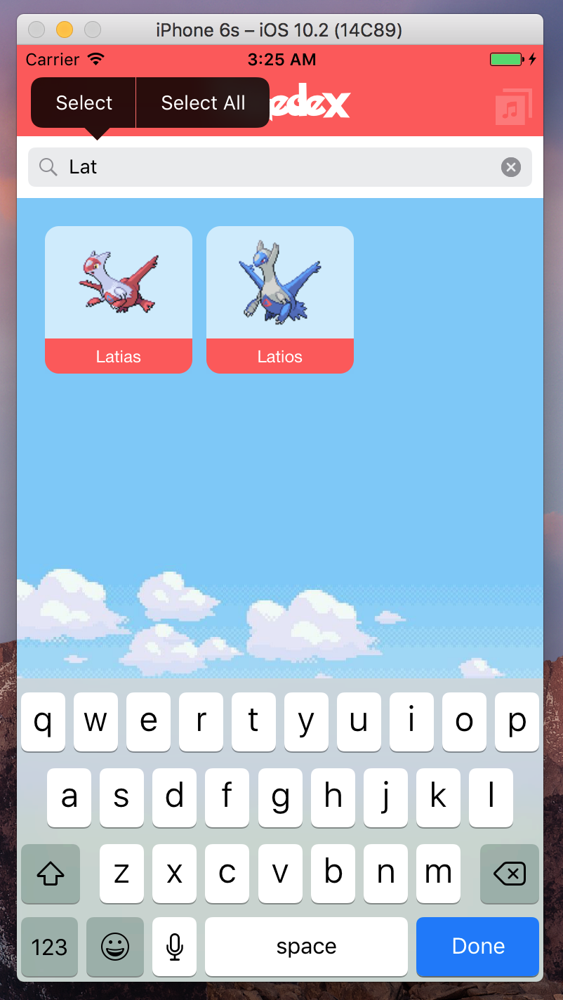

# Pokedex-app
app made while following along in online udemy course for iOS10 and swift 3 development. Will be a pokedex that grabs info off of the pokemon API website to put into app. 
API used in app found here: https://pokeapi.co/  

# Work in progress:   
So far music plays in background which can be muted at any time and resumed.  
You can scroll down through 700+ Pokemon  
Click on one of the collection views and it will display information for the chosen Pokemon.
Added shiny button so that when pressed all sprites have their colours changed to their shiny forms.  
Shiny button affects main pages collection view as well as details screen  
Took out placeholder images and data. App now downloads needed info to replace the old placeholder stuff.

  

  

  

